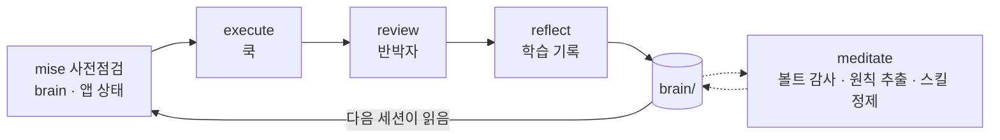

<div align="center">


[English](README.md) · **한국어**

<br>

*서브에이전트 오케스트레이션 워크스페이스 — 소바 가게(蕎麦屋)처럼:*<br>
*워크스페이스는 주방, 오케스트레이션하는 Claude 세션은 헤드 쿡,*<br>
*서브에이전트는 브리게이드, `apps/`의 프로젝트 하나하나가 요리입니다.*

<br>

[시작하기](#시작하기) · [세션의 흐름](#세션의-흐름) · [구성 요소](#구성-요소) · [superpowers와의 분담](#superpowers와의-분담) · [noodle에서 Sobaya로](#noodle에서-sobaya로)

</div>

---

Sobaya는 [poteto/noodle](https://github.com/poteto/noodle)의 작업 방식을 Claude Code 네이티브 프리미티브 위로 옮긴 것입니다. **프레임워크가 아닙니다** — 데몬도 스케줄러도 없고, 런타임은 셸 훅 2개뿐입니다. max effort 모델(Opus 4.8 / Fable 5)이 오케스트레이션을 잘하게 만드는 규칙·스킬·영속 메모리의 집합이며, 개발 수명주기를 담당하는 [superpowers](https://github.com/obra/superpowers) 플러그인과 함께 동작합니다.

## 시작하기

```sh
cd sobaya && claude
```

세션이 열리면 brain 인덱스가 이미 주입된 상태입니다. 거기서부터는 세 가지 동작이 대부분을 해결합니다:

| 하고 싶은 일 | 일어나는 일 |
|---|---|
| **새 앱 만들기** | `new-app`이 `apps/<이름>` 스캐폴드 + git init + 레지스트리 등록 — 설계는 brainstorming을 먼저 거칩니다 |
| **앱 작업** | 굵직한 요청은 `sobaya` 스킬이 받습니다: 사전점검 → 디스패치 → 파이프라인 |
| **마무리** | `reflect`가 세션의 학습을 기록하고, 쌓이면 `meditate`가 볼트를 정리합니다 |

## 세션의 흐름

작업은 정해진 파이프라인을 따라 흐르고, 배운 것은 전부 `brain/`에 남아 다음 세션이 이어받습니다:



- **사전점검** — 오케스트레이터는 디스패치 전에 brain 인덱스(훅 주입), 관련 노트, 앱 git 상태, 진행 중인 플랜을 읽습니다
- **execute → review** — 쿡이 구현하고, 리뷰는 구현에 참여하지 않은 독립 반박자가 "반박하라"는 지시를 받아 맡습니다
- **reflect / meditate** — 학습은 볼트로 라우팅되고, 누적된 교훈은 원칙과 스킬 수정이 됩니다

## 구성 요소

- **스킬 4종** — `sobaya`(오케스트레이션 플레이북), `new-app`(앱 스캐폴드), `reflect`(학습 기록), `meditate`(볼트 감사 + 스킬 정제)
- **훅 2종** — 세션 시작 시 brain 인덱스 주입, brain 쓰기 시 인덱스 자동 재생성 (결정론적 POSIX 셸, fail-open, 원자적 쓰기)
- **brain/ 볼트** — Obsidian 호환 영속 메모리: 원칙 10종, 지식 노트, 플랜, 백로그
- **apps/ 구조** — 프로젝트마다 독립 git 저장소, 루트 저장소는 하네스만 추적

## superpowers와의 분담

superpowers가 개발 수명주기를 소유하고, Sobaya는 그 둘레의 워크스페이스를 소유합니다. 경계를 명시해서 둘이 같은 트리거를 두고 경쟁하지 않습니다:

| 단계 | 담당 | 일어나는 일 |
|---|---|---|
| 설계 | superpowers:brainstorming | 창작 작업 전 필수 게이트 — `new-app`도 새 제품 설계는 여기에 위임 |
| 스펙·플랜 | superpowers:writing-plans | 산출물은 `brain/plans/NN-slug/`에 저장 (overview.md = 스펙, phase-*.md = 플랜) — Sobaya의 위치 선호를 플러그인이 존중 |
| 구현 | superpowers:subagent-driven-development 또는 executing-plans + TDD | 디스패치 자체는 Sobaya의 `sobaya` 스킬이 통제: 브리핑, 격리, 동시성, 실패 처리 |
| 디버깅 | superpowers:systematic-debugging | 쿡과 오케스트레이터 모두 사용 |
| 리뷰 | superpowers 코드리뷰 + Sobaya 반박자 디스패치 | 구현하지 않은 독립 에이전트에게 "반박하라"고 지시 |
| 학습 | Sobaya `reflect` / `meditate` | 세션 학습 → brain, 누적 교훈 → 원칙·스킬 수정 |

전형적인 기능 개발 한 사이클: 설계 브레인스토밍(게이트) → `brain/plans/`에 스펙+플랜 → 플랜대로 쿡 디스패치 → 반박자 리뷰 → reflect. **수명주기는 superpowers의 것, 주방 규율은 Sobaya의 것**입니다.

## noodle에서 Sobaya로

noodle은 파일 기반 작업 주문 위에서 LLM "쿡" 세션을 스케줄링하는 Go 이벤트 루프입니다. Sobaya는 플로우는 유지하고 기계만 바꿨습니다: noodle의 Go 루프가 기계적으로 하던 일은 전부 Claude Code 프리미티브 아니면 오케스트레이션 세션이 따르는 컨벤션이 됐습니다.

<details>
<summary><b>전체 대응표 — noodle의 모든 메커니즘과 Sobaya의 대응물</b></summary>

<br>

| noodle (Go 런타임) | Sobaya (Claude Code 네이티브) |
|---|---|
| 이벤트 루프 사이클이 모든 것을 구동 | 대화형 세션이 곧 루프 — 오케스트레이터(헤드 쿡)가 구동 |
| 사이클마다 재생성되는 `mise.json` 컨텍스트 브리프 | `sobaya` 스킬의 사전점검: brain 인덱스(훅 주입) → 관련 노트 → `apps.md` + 앱 git 상태 → todos + 진행 중 플랜 |
| `schedule` 에이전트가 `orders-next.json` 작성 | 오케스트레이터의 판단 — 굵직한 작업은 먼저 `brain/plans/NN-slug/`에 플랜부터 (디스패치 전 영속화) |
| 주문이 스테이지를 따라 전진: execute → quality → reflect | 단계별 디스패치: execute → review(반박자) → reflect, 각 단계의 산출물을 먼저 선언 |
| 쿡은 프로바이더 CLI 자식 프로세스, 스킬 하나씩 | Agent 도구로 서브에이전트 디스패치, 작업 지시서처럼 브리핑(템플릿은 `sobaya` 스킬 references) |
| 쿡마다 git 워크트리, 머지 락, 순차 머지 | 앱당 작성자 1명; 병렬 변경은 에이전트당 워크트리 1개; 머지는 순차, 사이사이 검증 |
| `stage_yield` — 산출물 ≠ 프로세스 종료 | 서브에이전트가 진행 산출물을 파일로 점진 기록 — 중단돼도 작업이 살아남음 |
| 크래시 복구: `orders.json` 스테이징 + 세션 입양 | 긴 디스패치 *전에* 플랜/진행 파일이 존재 — 다음 세션이 `brain/plans` 체크박스로 이어받음 |
| 스케줄러 주도 복구, 자동 재시도 없음 | 진단 후 결정: 실패한 디스패치의 출력을 읽기 전에는 재디스패치하지 않음 |
| brain 볼트 + reflect/meditate 자기개선 | 그대로 이식: reflect가 학습을 라우팅(구조 > 스킬 수정 > 노트 > todo), meditate가 서브에이전트로 볼트 감사 |
| `inject-brain` / `auto-index-brain` 훅 | fail-open POSIX 훅으로 이식 + 와이어링 수정(Claude Code matcher는 경로가 아니라 도구 이름) |
| 자율 cron 루프, 웹 UI, NDJSON 이벤트 소싱 | 의도적으로 제외 — `/loop` / `/schedule`은 미래 옵션으로 남김 (백로그 #4) |

</details>

## 저장소 구조

```
sobaya/
├── CLAUDE.md          # 하네스 계약 (EN, ~40줄)
├── banner.svg
├── .claude/
│   ├── settings.json  # 훅 와이어링
│   ├── hooks/         # inject-brain, auto-index-brain
│   └── skills/        # sobaya, new-app, reflect, meditate
├── brain/             # 영속 메모리 볼트 (EN)
│   ├── index.md       # 훅이 생성 — 직접 수정 금지
│   ├── principles/    # 의사결정 원칙 10종
│   ├── codebase/      # 지식·gotcha 노트
│   ├── plans/         # NN-slug/ (overview = 스펙, phase-* = 플랜)
│   ├── todos.md       # 영구 번호 백로그
│   └── archive/
├── apps/              # 프로젝트들 — 각자 독립 git 저장소 (여기선 gitignore)
├── references/        # 참조 클론 (noodle) — gitignore
├── tests/             # 훅 테스트 (sh tests/hooks-test.sh)
└── docs/              # 가이드 (한국어)
```

## 출처

- **noodle** (커밋 `82d2921` 분석) — brain 볼트 구조, reflect/meditate 루프, 결정론적 훅, 그리고 Go 메카닉의 컨벤션화(원자적 쓰기, 대상당 작성자 1명, 워크트리 격리, 진단 후 재시도). 작업 클론: `references/noodle/`
- **superpowers** — 개발 수명주기 전체(브레인스토밍 → 플랜 → TDD → 디버깅 → 리뷰)는 superpowers 스킬을 따르고, Sobaya는 그것이 제공하지 않는 것만 더합니다

사용 가이드: [docs/guide.md](docs/guide.md) · 설계 스펙: [brain/archive/plans/01-sobaya-harness/overview.ko.md](brain/archive/plans/01-sobaya-harness/overview.ko.md)
