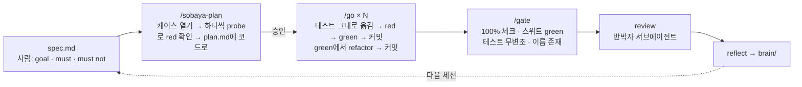

<div align="center">


[English](README.md) · **한국어**

<br>

*실패하는 테스트가 먼저, 에이전트는 그다음.*<br>
*TDD 위에 세운 에이전틱 엔지니어링 워크스페이스: 사람이 spec과 실패 테스트를 전부 쓰고,*<br>
*에이전트 루프가 하나씩 green으로 만들고, 게이트가 테스트를 건드린 결과를 거부합니다.*

<br>

[루프](#루프) · [시작하기](#시작하기) · [게이트가 강제하는 것](#게이트가-강제하는-것) · [구성 요소](#구성-요소) · [워크스페이스 규율](#워크스페이스-규율) · [noodle에서 Sobaya로](#noodle에서-sobaya로)

</div>

---

Sobaya(蕎麦屋, 소바 가게)는 **실패하는 테스트가 곧 spec**인 워크스페이스입니다. 구현이 한 줄도 없는 상태에서 테스트 케이스를 전부 코드로 쓰고, 실제로 red임을 확인한 것만 `plan.md`에 기록합니다. 그다음 자율 루프가 앱 `AGENTS.md`의 TDD 규칙을 사이클마다 테스트 하나씩 적용합니다: 스위트에 그대로 옮기고, 실패를 보고, 최소한을 구현하고, green에서 리팩터링하고, 커밋. 플랜이 전부 체크되면 셸 게이트가 "스위트 green + 기존 테스트 줄 무변조"일 때만 완료를 선언합니다. 이 루프 둘레에 Sobaya가 주방을 붙입니다: 영속 메모리(`brain/`), 결정론적 훅, 서브에이전트 규율.

**프레임워크가 아니고 플러그인도 없습니다.** git, 셸, `claude -p`, 마크다운뿐입니다.

## 루프


```mermaid
flowchart LR
    S["spec.md<br>사람: goal · must · must not"] --> P["/sobaya-plan<br>케이스 열거 → 하나씩 probe로 red 확인 → plan.md에 코드로"]
    P -- 승인 --> G["/go × N<br>테스트 그대로 옮김 → red → green → 커밋<br>green에서 refactor → 커밋"]
    G --> T["/gate<br>100% 체크 · 스위트 green<br>테스트 무변조 · 이름 존재"]
    T --> R["review<br>반박자 서브에이전트"]
    R --> F["reflect → brain/"]
    F -. 다음 세션 .-> S
```

| 단계 | 누가 | 일어나는 일 |
|---|---|---|
| **Spec** | 사람 | 앱 루트 `spec.md`: goal, must, must not. 에이전트는 읽기만 하고 절대 수정하지 않습니다. |
| **Plan** | 사람, `/sobaya-plan`이 초안 | 에이전트가 기능을 쪼개고 케이스를 최대한 열거해 하나씩 probe(패키지에 임시 파일로 넣고, 실행하고, 삭제)한 뒤 **RED**인 것만 `plan.md`에 체크박스 + 완전한 테스트 함수로 적습니다. 그리고 한 번 묻습니다: *검토·추가 끝나셨으면 이대로 진행할까요?* 사람은 `plan.md`를 직접 고치고, 케이스를 더하고, 약한 것을 뺍니다. 검토했는지 검증하는 장치는 없습니다. 사람을 믿고, 루프는 그 테스트만큼만 좋습니다. |
| **Cycle** | `/go` (앱 `AGENTS.md` 규칙) | 다음 미체크 항목을 집습니다. 테스트를 **그대로** 스위트에 옮깁니다. 전체 스위트: red를 기대. 최소 코드로 green. 행위 변경을 커밋(테스트 + 코드 + 체크). 그다음 green 상태에서 한 번에 하나씩 리팩터(Go는 `gopher`), 구조 변경은 별도 커밋. 한 줄 보고, 종료. |
| **Loop** | `/sobaya-loop` (`loop.sh`) | "go"만 돌리고 절대 계획하지 않음. 미체크 항목이 없어질 때까지 `claude -p "go"` 반복, 회차가 항목을 추가하면(결함 흐름) 루프 안에서는 물어볼 사람이 없어 중단, 커밋 없는 사이클 3회면 중단. 잔여물은 stash에 보관. |
| **Gate** | `/gate` (`gate.sh`) | [게이트가 강제하는 것](#게이트가-강제하는-것) 참고. PASS 아니면 FAIL, 중간 없음. |
| **Review** | Sobaya 반박자 디스패치 | 구현에 참여하지 않은 독립 서브에이전트에게 "반박하라"고 지시. |
| **Learn** | `reflect` / `meditate` | 세션 학습 → `brain/`, 누적 교훈 → 원칙·스킬 수정. |

루프 도중 발견한 결함도 결함 규칙을 플랜을 통해 따릅니다: 에이전트가 API 수준 실패 테스트와 최소 재현 테스트를 probe로 확인해 `plan.md` 끝에 추가하고 커밋하면, 루프 안에서는 물어볼 사람이 없으니 멈춥니다. 사람이 보고 다시 돌립니다.

## 시작하기

```sh
cd sobaya && claude
```

| 하고 싶은 일 | 이렇게 |
|---|---|
| **앱, 새것이든 기존이든** | `tdd-set/bin/install.sh apps/<이름>` — 필요하면 git init, `AGENTS.md`에 TDD 규칙 이어 붙임, `spec.md`·`plan.md` 템플릿, `tdd`·`gopher` 스킬, `/sobaya-plan` `/go` `/gate` `/sobaya-loop` 명령, 커밋 훅. 멱등. 그다음 `brain/apps.md`에 한 줄 등록. |
| **기능 하나** | `spec.md`를 채웁니다. `/sobaya-plan`을 돌리고 초안을 읽고, `plan.md`에 케이스를 직접 더하고 빼고, 예라고 답합니다. 그다음 세션 안에서 `/go`를 사이클마다, 또는 `/sobaya-loop 30`으로 플랜 전체를, 그다음 `/gate`. |
| **버그 하나** | 재현하는 실패 테스트를 probe로 확인해 `plan.md`에 추가하고 `/go`. |
| **마무리** | `reflect`가 세션의 학습을 기록하고, 쌓이면 `meditate`가 볼트를 정리합니다. |

앱 `AGENTS.md`에 하네스가 실행할 명령줄을 선언합니다:

```markdown
- Test: `go test ./...`                      ← 게이트
- Format: `gofmt -l .`                       ← 커밋 훅, 출력이 없어야 함
- Lint: `go vet ./...`                       ← 커밋 훅, exit 0이어야 함
- Bench: `go test -bench=. -benchmem ./...`  ← 게이트가 출력; gopher가 전후 비교
```

## 게이트가 강제하는 것

`gate.sh`는 루프가 끝난 뒤 루프 시작 커밋과 현재 트리를 비교합니다. 전부 결정론적 셸이고 모델 판단은 없습니다.

| 검사 | FAIL 조건 |
|---|---|
| 플랜 완료 | `plan.md`에 `- [ ]`가 남아 있음 |
| 스위트 green | `Test:` 명령이 0이 아닌 코드로 종료 |
| 테스트 무변조 | 시작 커밋 이후 테스트 파일에서 삭제되거나 수정된 줄이 있음 (추가만 허용) |
| 이름 존재 | 체크된 항목의 이름을 가진 테스트 함수가 스위트에 추가되지 않음 |

커밋 훅(`commit-gate.sh`)은 `Format:`이 무언가 출력하거나 `Lint:`가 실패하면 `git commit`을 차단합니다. 워크스페이스 루트에서 친 `git -C apps/<이름> commit`도 마찬가지입니다.

## 구성 요소

**tdd-set/** — 수명주기
- `AGENTS.md` — TDD + Tidy First 규칙. 모든 앱 `AGENTS.md`에 이어 붙음(출처는 아래 '출처')
- `spec-template.md`, `plan-template.md` — 사람이 쓰는 문서 둘
- `skills/tdd` — CLAUDE.md에 없는 Phase 0(probe 후 기록)과 루프 가드; `skills/gopher` — Go 리팩터 체크리스트, 테스트가 참조하는 이름은 절대 바꾸지 않음
- `commands/` — `/sobaya-plan` `/go` `/gate` `/sobaya-loop`
- `bin/install.sh`, `bin/probe.sh`, `bin/loop.sh`, `bin/gate.sh`, `hooks/commit-gate.sh`

**워크스페이스** — 주방
- **스킬 3종** — `sobaya`(오케스트레이션), `reflect`, `meditate`
- **훅 4종** — 세션 시작 시 brain 인덱스 주입, brain 쓰기 시 인덱스 재생성, PreToolUse 가드 2종(Fable 전용 루트, 워크스페이스 규칙) — 결정론적 POSIX 셸, fail-open
- **brain/** — Obsidian 호환 영속 메모리: 원칙, 지식 노트, 앱 간 플랜, 백로그
- **apps/** — 프로젝트마다 독립 git 저장소, 루트 저장소는 하네스만 추적

## 워크스페이스 규율

루프는 앱 하나 안에서 돕니다. 그 둘레는 `sobaya` 스킬이 다스립니다: 사전점검(brain 인덱스 → 앱 git 상태 → 진행 중 플랜), 서브에이전트용 작업 지시서, 앱당 작성자 1명(병렬 변경은 에이전트당 워크트리 1개), 반박 리뷰, 재시도 전 진단, 디스패치 전 영속화(끊긴 세션을 다음 세션이 이어받도록). spec과 plan은 루프와 게이트가 읽는 앱 루트에 두고, `brain/plans/`에는 앱 간·하네스 플랜만 둡니다.

## noodle에서 Sobaya로

주방 컨벤션은 [poteto/noodle](https://github.com/poteto/noodle)에서 왔습니다. 파일 기반 작업 주문 위에서 LLM "쿡" 세션을 스케줄링하는 Go 이벤트 루프입니다. Sobaya는 그 플로우를 유지하고 기계는 버렸습니다.

<details>
<summary><b>전체 대응표 — noodle의 모든 메커니즘과 Sobaya의 대응물</b></summary>

<br>

| noodle (Go 런타임) | Sobaya (Claude Code 네이티브) |
|---|---|
| 이벤트 루프 사이클이 모든 것을 구동 | `loop.sh`가 TDD 사이클을 구동, 나머지는 대화형 세션이 구동 |
| 사이클마다 재생성되는 `mise.json` 컨텍스트 브리프 | `sobaya` 스킬의 사전점검: brain 인덱스(훅 주입) → 관련 노트 → `apps.md` + 앱 git 상태 → todos + 진행 중 플랜 |
| `schedule` 에이전트가 `orders-next.json` 작성 | 사람이 쓴 `plan.md`; 다음 미체크 항목이 다음 주문 |
| 주문이 스테이지를 따라 전진: execute → quality → reflect | 사이클 → 게이트 → 반박자 리뷰 → reflect, 각 단계의 산출물을 먼저 선언 |
| 쿡은 프로바이더 CLI 자식 프로세스, 스킬 하나씩 | 사이클마다 `claude -p "go"`; 그 둘레는 Agent 도구로 서브에이전트 |
| 쿡마다 git 워크트리, 머지 락, 순차 머지 | 앱당 작성자 1명; 병렬 변경은 에이전트당 워크트리 1개; 머지는 순차, 사이사이 검증 |
| `stage_yield` — 산출물 ≠ 프로세스 종료 | 모든 사이클은 커밋으로 끝남; 잔여물은 stash에 보관 |
| 크래시 복구: `orders.json` 스테이징 + 세션 입양 | `plan.md` 체크박스가 곧 상태; 어떤 세션이든 다음 미체크 항목에서 재개 |
| 스케줄러 주도 복구, 자동 재시도 없음 | 커밋 없는 사이클 3회면 루프 중단; 진단 후 결정 |
| brain 볼트 + reflect/meditate 자기개선 | 그대로 이식: reflect가 학습을 라우팅(구조 > 스킬 수정 > 노트 > todo), meditate가 서브에이전트로 볼트 감사 |
| `inject-brain` / `auto-index-brain` 훅 | fail-open POSIX 훅으로 이식 + 와이어링 수정(Claude Code matcher는 경로가 아니라 도구 이름) |
| 자율 cron 루프, 웹 UI, NDJSON 이벤트 소싱 | 의도적으로 제외 |

</details>

## 저장소 구조

```
sobaya/
├── AGENTS.md          # 하네스 계약 (EN); CLAUDE.md는 여기를 가리키기만 함
├── banner.svg
├── .claude/
│   ├── settings.json  # 훅 와이어링
│   ├── hooks/         # inject-brain, auto-index-brain, guard-fable-only, guard-workspace-rules
│   └── skills/        # → .agents/skills 링크 (sobaya, reflect, meditate, tdd + gopher)
├── .githooks/         # commit-msg — Fable 전용 에이전트 커밋 게이트
├── tdd-set/           # 수명주기: AGENTS.md 규칙, 템플릿, 스킬, 명령, bin/, hooks/
├── brain/             # 영속 메모리 볼트 (EN)
│   ├── index.md       # 훅이 생성 — 직접 수정 금지
│   ├── principles/    # 의사결정 원칙
│   ├── codebase/      # 지식·gotcha 노트
│   ├── plans/         # NN-slug/ 앱 간·하네스 플랜만 (앱 spec/plan은 앱 루트)
│   ├── todos.md       # 영구 번호 백로그
│   └── archive/
├── apps/              # 프로젝트들 — 각자 독립 git 저장소 (여기선 gitignore)
├── references/        # 참조 클론 (noodle) — gitignore
├── tests/             # 훅 테스트 (sh tests/hooks-test.sh)
└── docs/              # 가이드 (한국어)
```

## 출처

- **Kent Beck** — `tdd-set/AGENTS.md`는 그의 BPlusTree3 `rust/docs/CLAUDE.md` 원문(커밋 `e1f539e`); 플랜 체크리스트 아이디어는 그의 TCRSkill `plan.md`에서; 앱 `AGENTS.md`의 명령줄은 그의 `agent.md`를 따름
- **noodle** (커밋 `82d2921` 분석) — brain 볼트 구조, reflect/meditate 루프, 결정론적 훅, 그리고 Go 메카닉의 컨벤션화(원자적 쓰기, 대상당 작성자 1명, 워크트리 격리, 진단 후 재시도). 작업 클론: `references/noodle/`

사용 가이드: [docs/guide.md](docs/guide.md) · tdd-set 레퍼런스: [tdd-set/README.md](tdd-set/README.md)
