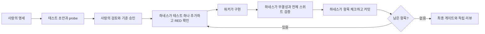

<div align="center">


### Sobaya

실패하는 테스트가 먼저, 에이전트는 그다음.

[English](README.md) · **한국어** · [가이드](docs/guide.md) · [런타임 레퍼런스](tdd-set/README.md) · [계약](AGENTS.md) · [검증 기록](docs/harness-validation.md)

</div>

Sobaya는 사람이 승인한 테스트를 중심으로 동작하는 개발 워크스페이스입니다.
사람이 명세를 소유하고 테스트 초안을 검토합니다. 하네스는 승인한 기준을
고정하고, 테스트 하나를 스위트에 넣어 RED를 확인하고, 구현을 위임한 다음
GREEN을 검증해야 진행 상황을 커밋합니다. 프로젝트는 `apps/<name>`의 독립
Git 저장소에 놓입니다.

## 작업 흐름


```mermaid
flowchart LR
    S[사람의 명세] --> D[테스트 초안과 probe]
    D --> A[사람의 검토와 기준 승인]
    A --> R[하네스가 테스트 하나 추가하고 RED 확인]
    R --> W[워커가 구현]
    W --> V[하네스가 무결성과 전체 스위트 검증]
    V --> C[하네스가 항목 체크하고 커밋]
    C --> N{남은 항목?}
    N -- 있음 --> R
    N -- 없음 --> G[최종 게이트와 독립 리뷰]
```

1. 앱 계약을 설치하고 `spec.md`에 의도한 동작을 적습니다.
2. `failed-test.md` 초안을 만들고 후보 테스트를 probe하여 기대값을 검토합니다.
   에이전트가 만든 테스트는 사람이 승인하기 전까지 초안입니다.
3. 검토한 입력을 커밋하고 `approve.sh`로 승인을 기록합니다.
4. `step.sh`로 한 항목, `loop.sh`로 연속 실행합니다. 워커는 소스를 구현하고,
   하네스가 테스트 삽입·검증·체크박스·커밋을 담당합니다.
5. 최종 게이트와 독립 리뷰를 마치고 배운 점을 기록합니다. 루프에는 별도 리뷰
   호출이 포함되며 지적 사항이 남으면 완료로 처리하지 않습니다. 구조 리팩터링은
   별도 작업으로 요청합니다.

```sh
python3 scripts/setup.py .
tdd-set/bin/install.sh apps/example
# 사람이 spec.md와 테스트 플랜을 검토한 뒤 해당 입력을 커밋합니다.
tdd-set/bin/approve.sh apps/example
tdd-set/bin/doctor.sh apps/example
tdd-set/bin/loop.sh apps/example 20
tdd-set/bin/status.sh apps/example
tdd-set/bin/gate.sh apps/example
```

명령은 워크스페이스 루트에서 실행합니다. 특정 제공자의 슬래시 명령은 필요하지
않습니다. [가이드](docs/guide.md)는 설치·테스트 변경·실패 복구를 설명합니다.

이미 통과하는 항목은 워커 호출 없이 테스트를 검증하고 커밋합니다. Go의 미정의
심볼을 RED로 허용하는 명시적 승인 옵션은 런타임 레퍼런스를 참조하세요.
[`economy.example.json`](tdd-set/policies/economy.example.json)은 Sol로 구현하고
진단 인계가 있을 때 Astra로 전환하며, 최종 리뷰는 Astra가 맡는 예제입니다.

## 보호하는 경계

| 경계 | 계약 |
|---|---|
| 사람의 승인 | 명세·플랜·앱 검증 명령을 커밋된 기준에 고정 |
| 테스트 무결성 | 승인한 테스트 본문·헤더와 기존 테스트·헬퍼·픽스처 보존 |
| 진행 | 검증된 항목 하나씩 전진; 워커 보고나 체크박스만으로는 승인 불가 |
| 결과 판정 | 전체 테스트 스위트와 필수 정리 검사; 최종 게이트로 완료 검증 |
| 실행 | 허용 워커·최대 호출 수·시간 제한 명시; 설정 없는 모델 승급 금지 |
| 동시성 | 체크아웃당 작성자 한 명; 병렬 변경은 독립 워크트리 사용 |

기본 워커는 Codex의 Astra입니다. 명시적 정책으로 다른 워커나 사용자 명령
어댑터를 고를 수 있으며, 판정 기준은 모두 같습니다. `selected`·`quality`·
`economy` 모드는 설정에 등록한 워커 선택에만 영향을 줍니다. 호출 수와 시간은
제한하지만, 사용량 기록이 통화 기준 예산 상한을 보장하지는 않습니다. 안전한
기본값은 새 세션이며, 항목별 검증 경계가 테스트당 세션 하나를 아키텍처로
강제하는 것은 아닙니다.

## 구성과 검증

- `AGENTS.md`: 간결한 공통 계약. 모델 이름이 아닌 작업 권한으로 유지보수합니다.
- `tdd-set/`: 승인·워커 실행·중간 검증·게이트·스택 스킬.
- `.agents/skills/`: 오케스트레이션·회고·볼트 관리.
- `brain/`: 관련 내용만 읽는 영속 지식.
- `docs/`: [사용 가이드](docs/guide.md)와 [출처 대응표](docs/from-noodle.ko.md).

하네스 테스트는 로컬 픽스처와 가짜 워커를 사용하며 유료 모델 세션을 실행하지
않습니다. 테스트 통과는 하네스에 대한 근거이며, 앱 테스트 플랜이 의도한 모든
동작을 포괄한다는 증명은 아닙니다. 명령과 정책 예시는
[런타임 레퍼런스](tdd-set/README.md)에 있습니다.

## 출처

TDD와 Tidy First는 Kent Beck의 BPlusTree3·TCRSkill 작업을 바탕으로 조정했습니다.
초기 개발 규칙의 역사적 출처는 BPlusTree3의 `rust/docs/CLAUDE.md`, 커밋
`e1f539e`이며 현재 규칙은 원문 그대로가 아닙니다. 워크스페이스 메모리·격리·
리뷰 방식은 [noodle](docs/from-noodle.ko.md)에서 영감을 받았습니다.
