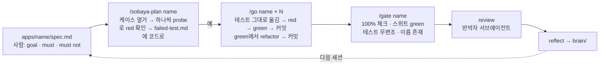

<div align="center">


### Sobaya

실패하는 테스트가 먼저, 에이전트는 그다음.

[English](README.md) · **한국어** · [가이드](docs/guide.md) · [tdd-set 레퍼런스](tdd-set/README.md) · [계약](AGENTS.md)

</div>

`sobaya`는 에이전틱 엔지니어링 워크스페이스입니다. 사람이 spec과 실패 테스트를 전부 쓰고, 루프가 TDD + Tidy First 규칙으로 테스트를 하나씩 green으로 만들고, 게이트가 테스트를 건드린 결과를 거부합니다. 플러그인도 데몬도 없습니다. git, 셸, `claude -p`, 마크다운뿐입니다.

## 특징

- 실패하는 테스트가 곧 spec: 구현이 없는 상태에서 모든 케이스를 코드로 쓰고 red임을 확인한 뒤 기록. Node는 작은 기능마다 파일 하나를 공유해 import·상수가 헤더 블록에 한 번만 들어감
- 사이클당 테스트 하나: 스위트에 옮기고, 실패를 보고, 최소한을 구현하고, green에서 리팩터링하고, 커밋
- 행위 변경과 구조 변경은 같은 커밋에 두지 않음
- 결정론적 게이트: 플랜 100% 체크, 스위트 green, 기존 테스트 줄 무변조, 체크한 항목의 테스트 존재
- 명령줄은 앱 `AGENTS.md`에 한 번만 선언(`Test`, `Format`, `Lint`, `Bench`), 게이트와 커밋 훅이 강제. `Skills:` 줄로 그 앱이 쓰는 스택 스킬을 고름
- 하네스는 루트에 하나: 계약, 스킬, 명령, 훅, TDD 규칙. 앱은 `AGENTS.md`·`spec.md`·`failed-test.md`만 갖고, 루트에서 이름으로 작업
- `brain/` 영속 메모리를 세션 시작 시 주입, fail-open 셸 훅, 앱당 작성자 1명

## 루프


```mermaid
flowchart LR
    S["apps/name/spec.md<br>사람: goal · must · must not"] --> P["/sobaya-plan name<br>케이스 열거 → 하나씩 probe로 red 확인 → failed-test.md에 코드로"]
    P -- 예 --> G["/go name × N<br>테스트 그대로 옮김 → red → green → 커밋<br>green에서 refactor → 커밋"]
    G --> T["/gate name<br>100% 체크 · 스위트 green<br>테스트 무변조 · 이름 존재"]
    T --> R["review<br>반박자 서브에이전트"]
    R --> F["reflect → brain/"]
    F -. 다음 세션 .-> S
```

- **Spec.** 사람이 `spec.md`를 채웁니다. 에이전트는 읽기만 하고 수정하지 않습니다.
- **Plan.** `/sobaya-plan <name>`이 `apps/<name>/failed-test.md` 초안을 만듭니다: 기능을 쪼개고, 케이스를 최대한 열거하고, 하나씩 probe해서 RED인 것만 남깁니다. 그리고 한 번 묻습니다. *검토·추가 끝나셨으면 이대로 진행할까요?* 사람은 파일을 직접 고칩니다. 검토 여부를 검증하는 장치는 없고, 루프는 사람의 테스트만큼만 좋습니다.
- **Cycle.** `/go <name>`이 다음 미체크 항목을 집어 테스트를 스위트에 이어 붙이고(Go: 패키지 테스트 파일, Node: 섹션 헤더가 지정한 파일) Red → Green → Refactor 한 사이클을 돕니다. 리팩터는 앱 `Skills:` 줄이 고른 스킬로. `/sobaya-loop <name>`은 플랜이 끝나거나 정체할 때까지 반복합니다.
- **Gate.** `/gate <name>`은 PASS 아니면 FAIL입니다. 루프 도중 발견한 결함은 probe한 테스트 두 개로 `failed-test.md`에 추가되고 루프는 사람을 위해 멈춥니다.
- **Review, reflect.** 독립 서브에이전트가 반박하고, 배운 것은 `brain/`에 남아 다음 세션이 읽습니다.

## 설치

```sh
tdd-set/bin/install.sh apps/<name>
```

앱이 갖는 파일 셋을 만듭니다: `AGENTS.md`(명령줄 + `Skills:`), `spec.md`, `failed-test.md`. 새 앱이든 기존 앱이든 되고, 멱등입니다. 나머지는 전부 루트에 있습니다. 자세한 내용은 [tdd-set 레퍼런스](tdd-set/README.md#install-per-app-new-or-existing).

## 사용

- 세션: `cd sobaya && claude` (또는 Codex). `apps/<name>/spec.md`를 채우고 `/sobaya-plan <name>`, 예라고 답하고, `/go <name>`을 사이클마다 또는 `/sobaya-loop <name>`, 그다음 `/gate <name>`. [사용 가이드](docs/guide.md) 참고.
- 셸: 루트에서 `tdd-set/bin/loop.sh apps/<name> 30`, `tdd-set/bin/gate.sh apps/<name>`. [tdd-set 레퍼런스](tdd-set/README.md) 참고.
- 다른 스택: `tdd-set/skills/<stack>`을 추가하고 앱 `Skills:` 줄에 이름을 적고 명령줄을 바꾸면 됩니다. 지금은 `go-mistakes`(Go, 100 Go Mistakes 카탈로그를 로컬에 미러링)와 `nodejs`(vitest 또는 `node --test`).

## 게이트가 강제하는 것

| 검사 | FAIL 조건 |
|---|---|
| 플랜 완료 | `failed-test.md`에 `- [ ]`가 남아 있음 |
| 스위트 green | `Test:` 명령이 0이 아닌 코드로 종료 |
| 테스트 무변조 | 루프 시작 이후 테스트 파일이나 테스트 디렉터리 안의 것(helper, fixture)에서 삭제되거나 수정된 줄이 있음 |
| 이름 존재 | 체크된 항목의 이름을 가진 테스트 함수가 추가되지 않음 |

커밋 훅은 `Format:`이 무언가 출력하거나 `Lint:`가 실패하면 `git commit`을 차단합니다.

## 문서

- [사용 가이드](docs/guide.md): 세션이 실제로 흘러가는 방식
- [tdd-set 레퍼런스](tdd-set/README.md): 파일·스크립트·명령 전부
- [AGENTS.md](AGENTS.md): 모든 에이전트가 읽는 하네스 계약
- [noodle에서 Sobaya로](docs/from-noodle.ko.md): 워크스페이스 컨벤션의 출처

## 출처

- **Kent Beck.** `tdd-set/AGENTS.md`는 그의 BPlusTree3 `rust/docs/CLAUDE.md` 원문(커밋 `e1f539e`). 플랜 체크리스트는 그의 TCRSkill `failed-test.md`에서. 앱 `AGENTS.md`의 명령줄은 그의 `agent.md`를 따름.
- **noodle.** brain 볼트, reflect/meditate, 결정론적 훅, 앱당 작성자 1명. [대응표](docs/from-noodle.ko.md)
