# Sobaya



서브에이전트 오케스트레이션 워크스페이스 — 소바 가게(蕎麦屋)처럼, 주방(워크스페이스)에서 헤드 쿡(Claude 세션)이 브리게이드(서브에이전트들)에게 일을 나눠주고 요리(`apps/`의 프로젝트들)를 완성합니다.

[poteto/noodle](https://github.com/poteto/noodle)의 작업 방식을 Claude Code 네이티브로 옮긴 하네스 환경입니다. 프레임워크가 아니라, max effort 모델(Opus 4.8 / Fable 5)이 일하기 좋은 규칙·스킬·메모리의 집합입니다.

## 무엇이 들어있나

- **스킬 4종** — `sobaya`(오케스트레이션 플레이북), `new-app`(앱 스캐폴드), `reflect`(세션 학습 기록), `meditate`(볼트 감사 + 스킬 자기개선)
- **훅 2종** — 세션 시작 시 brain 인덱스 자동 주입, brain 파일 변경 시 인덱스 자동 재생성 (결정론적 POSIX 셸, 실패해도 세션을 깨지 않는 fail-open)
- **brain/ 볼트** — Obsidian 호환 영속 메모리: 원칙 10종, 지식 노트, 플랜, 백로그
- **apps/ 구조** — 프로젝트마다 독립 git 저장소, 워크스페이스 루트는 하네스만 추적

## 시작하기

```sh
cd sobaya && claude
```

세션이 열리면 훅이 brain 인덱스를 자동으로 주입합니다. 거기서부터:

- **새 앱** — "새 앱 만들어줘" → `new-app` 스킬이 `apps/<이름>` 스캐폴드 + git init + 레지스트리 등록 (새 제품 설계라면 brainstorming부터)
- **앱 작업** — 굵직한 작업을 시키면 `sobaya` 스킬이 사전점검(mise) → 서브에이전트 디스패치 → 파이프라인으로 진행
- **마무리** — 의미 있는 세션 끝에 `reflect`가 배운 것을 brain에 기록하고, 쌓이면 `meditate`가 볼트를 정리합니다

## 워크플로

```
        ┌────────────────── meditate (볼트 감사 · 원칙 추출 · 스킬 정제) ◄─┐
        ▼                                                                  │
mise 사전점검 ─► execute ─► review ─► reflect ─► brain/ ───────────────────┘
(brain·앱 상태)   (cook)    (refuter)  (학습 기록)   (다음 세션이 읽음)
```

| 단계 | 담당 | 산출물 |
|---|---|---|
| 사전점검 | 오케스트레이터 (`sobaya` 스킬) | 한 문단 브리프 |
| execute | general-purpose 서브에이전트 (+워크트리) | 커밋, 진행 보고 파일 |
| review | 독립 서브에이전트 (반박 프롬프트) | 발견 목록 |
| reflect | 오케스트레이터 (`reflect` 스킬) | brain 노트 / 스킬 수정 / todo |

설계·플랜·TDD·디버깅·코드리뷰는 superpowers 플러그인이 담당합니다 — Sobaya는 그 위의 워크스페이스 계층만 맡습니다.

## 구조

```
sobaya/
├── CLAUDE.md          # 하네스 계약 (EN, ~30줄)
├── banner.svg
├── .claude/
│   ├── settings.json  # 훅 와이어링
│   ├── hooks/         # inject-brain, auto-index-brain
│   └── skills/        # sobaya, new-app, reflect, meditate
├── brain/             # 영속 메모리 볼트 (EN)
│   ├── index.md       # 훅이 자동 생성 — 직접 수정 금지
│   ├── principles/    # 의사결정 원칙 10종
│   ├── codebase/      # 지식·gotcha 노트
│   ├── plans/         # NN-slug/ (overview = 스펙, phase-* = 플랜)
│   ├── todos.md       # 영구 번호 백로그
│   └── archive/
├── apps/              # 프로젝트들 — 각자 독립 git 저장소 (루트에서 gitignore)
├── references/        # 참조 클론 (noodle) — gitignore
├── tests/             # 훅 테스트 (sh tests/hooks-test.sh)
└── docs/              # 한국어 문서
```

## noodle과 superpowers의 관계

- **noodle** (커밋 `82d2921` 분석) — brain 볼트 구조, reflect/meditate 자기개선 루프, 결정론적 훅, 그리고 Go 메카닉의 컨벤션화(원자적 쓰기, 앱당 작성자 1명, 워크트리 격리, 진단 후 재시도)를 가져왔습니다. 작업 클론: `references/noodle/`
- **superpowers** — 개발 수명주기(브레인스토밍 → 플랜 → TDD → 디버깅 → 리뷰)는 전부 superpowers 스킬을 따릅니다. Sobaya 스킬은 충돌하지 않도록 워크스페이스 오케스트레이션과 자기개선만 다룹니다

자세한 사용법: [docs/guide.md](docs/guide.md) · 설계 스펙: [brain/archive/plans/01-sobaya-harness/overview.ko.md](brain/archive/plans/01-sobaya-harness/overview.ko.md)
