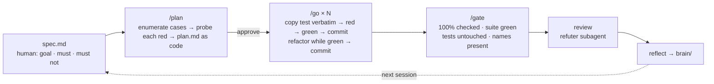

<div align="center">



**English** · [한국어](README.ko.md)

<br>

*Failing tests first, then the agent.*<br>
*An agentic-engineering workspace built on Kent Beck's TDD: the human writes the spec and every failing test,*<br>
*the agent loop turns them green one at a time, and a gate refuses anything that touched the tests.*

<br>

[The loop](#the-loop) · [Getting started](#getting-started) · [What the gate enforces](#what-the-gate-enforces) · [What's inside](#whats-inside) · [Workspace discipline](#workspace-discipline) · [From noodle to Sobaya](#from-noodle-to-sobaya)

</div>

---

Sobaya (蕎麦屋, a soba shop) is a workspace where the **failing tests are the spec**. Before any implementation exists, every test case is written as code, proven red, and recorded in `plan.md`. An autonomous loop then runs Kent Beck's TDD rules — his `CLAUDE.md`, verbatim — one test per cycle: copy it into the suite, watch it fail, write the minimum, refactor while green, commit. When the plan is fully checked, a shell gate declares the feature done only if the suite is green and no existing test line was modified. Around that loop, Sobaya adds the kitchen: persistent memory (`brain/`), deterministic hooks, and subagent discipline.

It is **not a framework** and uses **no plugins** — git, shell, `claude -p`, and markdown.

## The loop


```mermaid
flowchart LR
    S["spec.md<br>human: goal · must · must not"] --> P["/plan<br>enumerate cases → probe each red → plan.md as code"]
    P -- approve --> G["/go × N<br>copy test verbatim → red → green → commit<br>refactor while green → commit"]
    G --> T["/gate<br>100% checked · suite green<br>tests untouched · names present"]
    T --> R["review<br>refuter subagent"]
    R --> F["reflect → brain/"]
    F -. next session .-> S
```

| Stage | Who | What happens |
|---|---|---|
| **Spec** | Human | `spec.md` in the app root: goal, must, must-not. Agents read it and never edit it. |
| **Plan** | `/plan` (the `tdd` skill, Phase 0) | Split the feature into small features and enumerate as many test cases as possible. Each candidate is run through `probe.sh`: dropped into the package as a temporary file, executed, deleted. Only tests that print **RED** are written into `plan.md` — as a checkbox plus the complete test function. The code lives in the doc, not in the suite. Human approves. |
| **Cycle** | `/go` (Kent Beck's `CLAUDE.md`) | Take the next unchecked entry. Copy its test **verbatim** into the suite. Full suite: expect red. Minimum code to green. Commit the behavioral change (test + code + checked box). Then, still green, refactor one step at a time (`gopher` for Go) and commit structural changes separately. Report one line, stop. |
| **Loop** | `/loop` (`loop.sh`) | Repeats `claude -p "go"` until no unchecked entry remains. Stops after three cycles without a commit. Uncommitted leftovers are stashed, never lost. |
| **Gate** | `/gate` (`gate.sh`) | See [What the gate enforces](#what-the-gate-enforces). PASS or FAIL, nothing in between. |
| **Review** | Sobaya refuter dispatch | An independent subagent told to refute the work — never the one that implemented it. |
| **Learn** | `reflect` / `meditate` | Session learnings → `brain/`; accumulated lessons → principles and skill edits. |

A defect found mid-loop follows Kent Beck's rule through the plan: probe an API-level failing test and the smallest reproducing test, append both to `plan.md`, commit, and let the next cycles take them.

## Getting started

```sh
cd sobaya && claude
```

| You want | Do this |
|---|---|
| **A new app** | Ask for `new-app`. It scaffolds `apps/<name>` as its own git repo, installs tdd-set (Kent Beck's `CLAUDE.md`, `spec.md` and `plan.md` templates, the `tdd` and `gopher` skills, the `/plan` `/go` `/gate` `/loop` commands, the commit hook) and registers the app. |
| **A feature** | Fill `spec.md`. Run `/plan`, approve the list. Then `/go` per cycle in the session, or `/loop 30` for the whole plan, then `/gate`. |
| **A bug** | Probe a failing test that reproduces it, append it to `plan.md`, `/go`. |
| **To wrap up** | `reflect` captures what the session learned; `meditate` periodically curates the vault. |

The app's `CLAUDE.md` declares the command lines the harness runs — the spot Kent Beck used for `cargo fmt` and `cargo test` in his `agent.md`:

```markdown
- Test: `go test ./...`                      ← gate
- Format: `gofmt -l .`                       ← commit hook, must print nothing
- Lint: `go vet ./...`                       ← commit hook, must exit 0
- Bench: `go test -bench=. -benchmem ./...`  ← gate prints it; gopher compares before/after
```

## What the gate enforces

`gate.sh` runs after the loop and compares the tree against the commit the loop started from. Every check is deterministic shell; there is no model judgment.

| Check | Fails when |
|---|---|
| Plan complete | any `- [ ]` remains in `plan.md` |
| Suite green | the `Test:` command exits non-zero |
| Tests untouched | any line in a test file was removed or modified since the start commit (additions only) |
| Names present | an entry was checked but no test function with that name was added to the suite |

The commit hook (`commit-gate.sh`) blocks `git commit` when `Format:` prints anything or `Lint:` fails — also for `git -C apps/<name> commit` issued from the workspace root.

## What's inside

**tdd-set/** — the lifecycle
- `CLAUDE.md` — Kent Beck's TDD + Tidy First rules, verbatim ([source](https://github.com/KentBeck/BPlusTree3/blob/main/rust/docs/CLAUDE.md), commit `e1f539e`)
- `spec-template.md`, `plan-template.md` — the two human documents
- `skills/tdd` — Phase 0 (probe-then-record) and the loop guards CLAUDE.md lacks; `skills/gopher` — Go refactor checklist, never renames what a test references
- `commands/` — `/plan` `/go` `/gate` `/loop`
- `bin/probe.sh`, `bin/loop.sh`, `bin/gate.sh`, `hooks/commit-gate.sh`

**Workspace** — the kitchen
- **4 skills** — `sobaya` (orchestration), `new-app` (scaffold + tdd-set install), `reflect`, `meditate`
- **4 hooks** — brain index injected at session start; index rebuilt on brain writes; two PreToolUse guards (Fable-only root, workspace rules) — deterministic POSIX shell, fail-open
- **brain/** — Obsidian-compatible persistent memory: principles, codebase notes, cross-app plans, backlog
- **apps/** — every project is its own git repository; the root repo tracks only the harness

## Workspace discipline

The loop runs inside one app. The `sobaya` skill governs everything around it: pre-flight (brain index → app git state → active plans), work-order briefs for subagents, one writer per app (parallel mutation means one worktree per agent), review by refutation, diagnose-before-retry, and persist-before-spawn so an interrupted session can be adopted by the next one. Spec and plan live in the app root because the loop and gate read them there; `brain/plans/` keeps only cross-app and harness plans.

## From noodle to Sobaya

The kitchen conventions come from [poteto/noodle](https://github.com/poteto/noodle), a Go event loop that schedules LLM "cook" sessions over file-based work orders. Sobaya keeps its flow and drops its machinery.

<details>
<summary><b>The full mapping — every noodle mechanism and its Sobaya counterpart</b></summary>

<br>

| noodle (Go runtime) | Sobaya (Claude Code native) |
|---|---|
| Event-loop cycles drive everything | `loop.sh` drives the TDD cycles; an interactive session drives everything else |
| `mise.json` context brief, rebuilt per cycle | `sobaya` skill pre-flight: brain index (hook-injected) → relevant notes → `apps.md` + app git status → todos + active plans |
| `schedule` agent writes `orders-next.json` | The human-written `plan.md`; the next unchecked entry is the next order |
| Orders advance through stages: execute → quality → reflect | cycle → gate → refuter review → reflect, each stage's deliverable declared up front |
| Cooks spawn as provider-CLI child processes, one skill each | `claude -p "go"` per cycle; subagents via the Agent tool for everything around it |
| Git worktree per cook, merge locks, sequential merges | One writer per app; parallel mutation = one worktree per agent; merges sequential, verified between |
| `stage_yield` — deliverable ≠ process exit | Every cycle ends in a commit; leftovers are stashed, never lost |
| Crash recovery: `orders.json` staging + session adoption | `plan.md` checkboxes are the state; any session resumes at the next unchecked entry |
| Scheduler-driven recovery, never auto-retry | Three cycles without a commit stop the loop; diagnose-then-decide |
| Brain vault + reflect/meditate self-improvement | Ported intact: reflect routes learnings (structure > skill edit > note > todo), meditate audits the vault with subagents |
| `inject-brain` / `auto-index-brain` hooks | Ported as fail-open POSIX hooks, with a wiring fix (Claude Code matchers are tool names, not paths) |
| Autonomous cron loop, web UI, NDJSON event sourcing | Deliberately absent |

</details>

## Repository layout

```
sobaya/
├── CLAUDE.md          # harness contract (EN)
├── banner.svg
├── .claude/
│   ├── settings.json  # hook wiring
│   ├── hooks/         # inject-brain, auto-index-brain, guard-fable-only, guard-workspace-rules
│   └── skills/        # sobaya, new-app, reflect, meditate, tdd + gopher (links into tdd-set/)
├── .githooks/         # commit-msg — Fable-only agent commit gate
├── tdd-set/           # the lifecycle: Kent Beck CLAUDE.md, templates, skills, commands, bin/, hooks/
├── brain/             # persistent memory vault (EN)
│   ├── index.md       # hook-generated — never hand-edit
│   ├── principles/    # decision rules
│   ├── codebase/      # knowledge & gotcha notes
│   ├── plans/         # NN-slug/ cross-app or harness plans only (app spec/plan live in the app root)
│   ├── todos.md       # permanent-ID backlog
│   └── archive/
├── apps/              # projects — each its own git repo (gitignored here)
├── references/        # reference clones (noodle) — gitignored
├── tests/             # hook test suite (sh tests/hooks-test.sh)
└── docs/              # guides (Korean)
```

## Attribution

- **Kent Beck** — `tdd-set/CLAUDE.md` is his BPlusTree3 `rust/docs/CLAUDE.md` verbatim (commit `e1f539e`); the plan-as-checklist idea comes from his TCRSkill `plan.md`; the command lines in the app `CLAUDE.md` follow his `agent.md`
- **noodle** (analyzed at commit `82d2921`) — brain vault structure, the reflect/meditate loop, deterministic hooks, and its Go mechanics adopted as conventions (atomic writes, one writer per target, worktree isolation, diagnose-don't-retry). Working clone: `references/noodle/`

Usage guide (Korean): [docs/guide.md](docs/guide.md) · tdd-set reference: [tdd-set/README.md](tdd-set/README.md)
