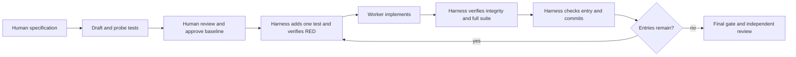

<div align="center">


### Sobaya

Failing tests first, then the agent.

**English** · [한국어](README.ko.md) · [Guide](docs/guide.md) · [Runtime reference](tdd-set/README.md) · [Contract](AGENTS.md) · [Validation report](docs/harness-validation.md)

</div>

Sobaya is an engineering workspace built around human-approved tests. The
human owns the specification and reviews test drafts. The harness freezes
that approval, materializes one test, observes RED, delegates implementation,
and validates GREEN before committing progress. Projects live in independent
Git repositories at `apps/<name>`.

The harness runtime and its tests use Bash 3.2, jq, Git, and standard Unix
tools. App test runners (Go, Node, or local Vitest) are separate dependencies.
Run the full local harness suite with `bash tests/run.sh`; it blocks Python
interpreter use and Python harness sources in the repository.

## Workflow


```mermaid
flowchart LR
    S[Human specification] --> D[Draft and probe tests]
    D --> A[Human review and approve baseline]
    A --> R[Harness adds one test and verifies RED]
    R --> W[Worker implements]
    W --> V[Harness verifies integrity and full suite]
    V --> C[Harness checks entry and commits]
    C --> N{Entries remain?}
    N -- yes --> R
    N -- no --> G[Final gate and independent review]
```

1. Install the app contract and fill `spec.md` with the intended behavior.
2. Draft `failed-test.md`, probe candidates, and review every expectation.
   Generated tests remain drafts until the human approves them.
3. Commit the reviewed inputs and record approval with `approve.sh`.
4. Run one `step.sh` or continue with `loop.sh`. Workers implement source;
   the harness owns test insertion, validation, checkboxes, and commits.
5. Run the final gate and complete independent review, then
   capture durable lessons. The loop includes a separate reviewer call; findings leave completion pending.
   Request any structural refactor separately.

```sh
bash scripts/setup.sh .
tdd-set/bin/install.sh apps/example
# Human fills spec.md and reviews the test plan; commit reviewed inputs.
tdd-set/bin/approve.sh apps/example
tdd-set/bin/doctor.sh apps/example
tdd-set/bin/loop.sh apps/example 20
tdd-set/bin/status.sh apps/example
tdd-set/bin/gate.sh apps/example
```

Run commands from the workspace root. No provider-specific slash commands
are needed. [The guide](docs/guide.md) covers setup, changed tests, and recovery.

Already passing entries get a verified test-only checkpoint without a worker
call. See the runtime reference for explicit Go missing-symbol RED approval and
[`economy.example.json`](tdd-set/policies/economy.example.json) for Sol execution
with diagnostic handoff to Astra and an Astra review.

## What is protected

| Boundary | Contract |
|---|---|
| Human approval | Specification, plan, and app acceptance commands are frozen against a committed baseline |
| Test integrity | Approved test bodies and headers, existing tests, helpers, and fixtures must remain intact |
| Progress | One verified entry at a time; a worker report or checked box alone is not acceptance |
| Acceptance | Full declared test suite and required hygiene checks; final gate verifies completion |
| Execution | Explicit allowed workers, maximum calls, and timeout; no unconfigured model upgrade |
| Concurrency | One writer per checkout; parallel mutation requires isolated worktrees |

The default worker is Astra through Codex. An explicit policy can select
other workers or a custom command adapter; all use the same acceptance
rules. `selected`, `quality`, and `economy` modes control only configured
worker choices. Call and time limits are hard limits; reported usage is
not a guaranteed currency budget. Fresh sessions are the safe default;
entry checkpoints do not depend on a one-session-per-test architecture.

## Layout and verification

- `AGENTS.md`: concise shared contract; maintenance is authorized by task,
  not by model name.
- `tdd-set/`: approval, worker execution, checkpoints, gate, and stack skills.
- `.agents/skills/`: orchestration, reflection, and vault maintenance.
- `brain/`: persistent knowledge, loaded only when relevant.
- `docs/`: [usage guide](docs/guide.md) and [source mapping](docs/from-noodle.md).

Harness tests use local fixtures and fake workers; they do not launch paid
model sessions. Passing them is evidence about the harness, not proof that
an arbitrary app's test plan captures all intended behavior. See the
[runtime reference](tdd-set/README.md) for commands and policy examples.

## Attribution

TDD and Tidy First practices are adapted from Kent Beck's BPlusTree3 and
TCRSkill work. The historical source for the original development rules was
BPlusTree3 `rust/docs/CLAUDE.md` at commit `e1f539e`; the current rules are
adapted, not verbatim. Workspace memory, isolation, and review practices
were inspired by [noodle](docs/from-noodle.md).
