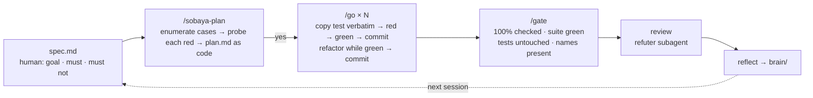

<div align="center">


### Sobaya

Failing tests first, then the agent.

**English** · [한국어](README.ko.md) · [Guide](docs/guide.md) · [tdd-set reference](tdd-set/README.md) · [Contract](AGENTS.md)

</div>

`sobaya` is an agentic engineering workspace. The human writes the spec and every failing test. A loop turns them green one test at a time under TDD + Tidy First rules. A gate refuses anything that touched the tests. No plugins, no daemon. Just git, shell, `claude -p`, and markdown.

## Features

- Failing tests are the spec: every case is written as code and proven red before any implementation exists
- One test per cycle: copy it into the suite, watch it fail, write the minimum, refactor while green, commit
- Behavioral and structural changes never share a commit
- Deterministic gate: plan 100% checked, suite green, no existing test line touched, every checked entry present in the suite
- Command lines declared once in the app `AGENTS.md` (`Test`, `Format`, `Lint`, `Bench`) and enforced by the gate and a commit hook
- One contract file for every agent, `AGENTS.md`, with `CLAUDE.md` pointing at it. One skills directory
- Persistent memory in `brain/`, injected at session start. Shell hooks that fail open. One writer per app

## The loop


```mermaid
flowchart LR
    S["spec.md<br>human: goal · must · must not"] --> P["/sobaya-plan<br>enumerate cases → probe each red → plan.md as code"]
    P -- yes --> G["/go × N<br>copy test verbatim → red → green → commit<br>refactor while green → commit"]
    G --> T["/gate<br>100% checked · suite green<br>tests untouched · names present"]
    T --> R["review<br>refuter subagent"]
    R --> F["reflect → brain/"]
    F -. next session .-> S
```

- **Spec.** The human fills `spec.md`. Agents read it, never edit it.
- **Plan.** `/sobaya-plan` drafts `plan.md`: split the feature, enumerate as many cases as possible, probe each one, keep only those that print RED. It asks once, *reviewed and added yours, proceed?*, and the human edits the file directly. Nothing verifies the review. The loop is exactly as good as the human's tests.
- **Cycle.** `/go` takes the next unchecked entry and runs one Red → Green → Refactor cycle. `/sobaya-loop` repeats it until the plan is done or stalls.
- **Gate.** `/gate` is PASS or FAIL, nothing in between. A defect found during the loop is appended to `plan.md` as two probed tests and the loop halts for the human.
- **Review, reflect.** An independent subagent refutes the work. Learnings land in `brain/` for the next session.

## Installation

```sh
tdd-set/bin/install.sh apps/<name>
```

Works on a new or an existing app, and is idempotent. Details in the [tdd-set reference](tdd-set/README.md#설치-앱마다-새것이든-기존이든).

## Usage

- Session: `cd sobaya && claude` (or Codex). Fill `spec.md`, run `/sobaya-plan`, answer yes, then `/go` per cycle or `/sobaya-loop 30`, then `/gate`. See the [usage guide](docs/guide.md).
- Shell: `../../tdd-set/bin/loop.sh 30` and `../../tdd-set/bin/gate.sh` from the app root. See the [tdd-set reference](tdd-set/README.md).
- Another stack: add `skills/<stack>` and swap the four command lines in the app `AGENTS.md`. `probe.sh` is Go only today.

## What the gate enforces

| Check | Fails when |
|---|---|
| Plan complete | any `- [ ]` remains in `plan.md` |
| Suite green | the `Test:` command exits non-zero |
| Tests untouched | any line in a test file was removed or modified since the loop started |
| Names present | an entry was checked but no test function with that name was added |

The commit hook blocks `git commit` when `Format:` prints anything or `Lint:` fails.

## Documentation

- [Usage guide](docs/guide.md) (Korean): how a session actually flows
- [tdd-set reference](tdd-set/README.md) (Korean): every file, script, and command
- [AGENTS.md](AGENTS.md): the harness contract every agent reads
- [From noodle to Sobaya](docs/from-noodle.md): where the workspace conventions come from

## Attribution

- **Kent Beck.** `tdd-set/AGENTS.md` is his BPlusTree3 `rust/docs/CLAUDE.md` verbatim (commit `e1f539e`). The plan as a checklist comes from his TCRSkill `plan.md`. The command lines in the app `AGENTS.md` follow his `agent.md`.
- **noodle.** Brain vault, reflect and meditate, deterministic hooks, one writer per app. [Mapping](docs/from-noodle.md)
