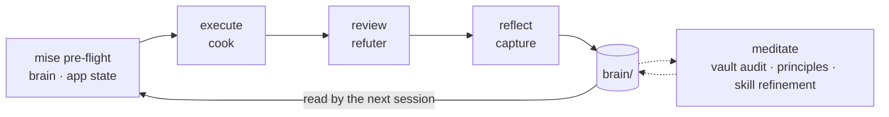

<div align="center">


**English** · [한국어](README.ko.md)

<br>

*A subagent-orchestration workspace — like a soba shop (蕎麦屋):*<br>
*the workspace is the kitchen, the orchestrating Claude session is the head cook,*<br>
*subagents are the brigade, and each project in `apps/` is a dish.*

<br>

[Getting started](#getting-started) · [How a session flows](#how-a-session-flows) · [What's inside](#whats-inside) · [How tdd-set fits](#how-tdd-set-fits) · [From noodle to Sobaya](#from-noodle-to-sobaya)

</div>

---

Sobaya ports the working methods of [poteto/noodle](https://github.com/poteto/noodle) onto native Claude Code primitives. It is **not a framework** — no daemon, no scheduler, no runtime beyond four shell hooks. It is a set of conventions, skills, and persistent memory that make max-effort models (Opus 4.8 / Fable 5) orchestrate well. The dev lifecycle is `tdd-set/` — Kent Beck's TDD rules plus a shell loop and gate, no external plugins.

## Getting started

```sh
cd sobaya && claude
```

Every session starts with the brain index already injected. From there, three moves cover most days:

| You want | What happens |
|---|---|
| **A new app** | `new-app` scaffolds `apps/<name>` + git init + registry entry — design goes through brainstorming first |
| **Work on an app** | Substantial requests trigger the `sobaya` skill: pre-flight → dispatch → pipeline |
| **To wrap up** | `reflect` captures what the session learned; `meditate` periodically curates the vault |

## How a session flows

Work moves through a fixed pipeline, and everything learned lands in `brain/` — where the next session picks it up:


```mermaid
flowchart LR
    P["mise pre-flight<br>brain · app state"] --> E["execute<br>cook"]
    E --> R["review<br>refuter"]
    R --> F["reflect<br>capture"]
    F --> B[("brain/")]
    B -- "read by the next session" --> P
    B -.-> M["meditate<br>vault audit · principles · skill refinement"]
    M -.-> B
```

- **pre-flight** — before dispatching anything, the orchestrator reads the brain index (hook-injected), relevant notes, app git status, and active plans
- **execute → review** — cooks implement; review goes to an independent refuter told to refute the work, never to the implementer
- **reflect / meditate** — learnings are routed into the vault; accumulated lessons become principles and skill edits

## What's inside

- **4 skills** — `sobaya` (orchestration playbook), `new-app` (scaffold), `reflect` (learning capture), `meditate` (vault audit + skill refinement)
- **tdd-set/** — the dev lifecycle: Kent Beck's TDD CLAUDE.md (verbatim), `tdd` + `gopher` skills, spec/plan templates, `loop.sh` + `gate.sh`, Go commit hook
- **4 hooks** — brain index injected at session start; index auto-rebuilt on brain writes; two PreToolUse guards enforcing the Fable-only root and the workspace rules (flat root, scaffold gate) — all deterministic POSIX shell, fail-open, atomic writes
- **brain/ vault** — Obsidian-compatible persistent memory: 10 principles, codebase notes, plans, backlog
- **apps/ layout** — every project is its own git repository; the root repo tracks only the harness

## How tdd-set fits

`tdd-set/` owns the dev lifecycle; Sobaya owns the workspace around it. No external plugins:

| Phase | Owner | What happens |
|---|---|---|
| Spec | Human | `spec.md` in the app root: goal, must, must-not — the brief Phase 0 enumerates tests from. Agents read it, never edit it |
| Plan | `tdd` skill, Phase 0 | Split the feature into small features, enumerate as many test cases as possible, probe each one with `bin/probe.sh` and write only those that print RED into `plan.md` as a **complete failing test** (code lives in the doc, not the suite) — approval before any code |
| Implement | Kent Beck's CLAUDE.md (verbatim) | "go" = copy the next entry's test verbatim into the suite: Red → Green → Refactor (Tidy First) → check off → commit. `bin/loop.sh` repeats `claude -p "go"` until the plan is done or stalls 3 times |
| Refactor | `gopher` skill + commit hook | Go checklist while green; `gofmt` / `go vet` failures block `git commit` |
| Gate | `bin/gate.sh` | PASS = every entry checked, suite green, no existing test line touched, each checked entry's test present in the suite. The human-written tests are the spec, so nothing else is judged |
| Review | Sobaya refuter dispatches | An independent agent told to refute the work — never the implementer |
| Learn | Sobaya `reflect` / `meditate` | Session learnings → brain; accumulated lessons → principles and skill edits |

A typical feature run: write `spec.md` → Phase 0 fills `plan.md` → loop → gate → refuter review → reflect. **The lifecycle is tdd-set's; the kitchen discipline is Sobaya's.**

## From noodle to Sobaya

noodle is a Go event loop that schedules LLM "cook" sessions over file-based work orders. Sobaya keeps the flow but swaps the machinery: everything the Go loop did mechanically became either a Claude Code primitive or a convention the orchestrating session follows.

<details>
<summary><b>The full mapping — every noodle mechanism and its Sobaya counterpart</b></summary>

<br>

| noodle (Go runtime) | Sobaya (Claude Code native) |
|---|---|
| Event-loop cycles drive everything | An interactive session is the loop; the orchestrator (head cook) drives |
| `mise.json` context brief, rebuilt per cycle | `sobaya` skill pre-flight: brain index (hook-injected) → relevant notes → `apps.md` + app git status → todos + active plans |
| `schedule` agent writes `orders-next.json` | Orchestrator judgment; substantial work gets a plan in `brain/plans/NN-slug/` first (persist-before-spawn) |
| Orders advance through stages: execute → quality → reflect | Staged dispatches: execute → review (refuter) → reflect, each stage's deliverable declared up front |
| Cooks spawn as provider-CLI child processes, one skill each | Subagents via the Agent tool, briefed like work orders (templates in the `sobaya` skill's references) |
| Git worktree per cook, merge locks, sequential merges | One writer per app; parallel mutation = one worktree per agent; merges sequential, verified between |
| `stage_yield` — deliverable ≠ process exit | Subagents write progress artifacts to files as they go; interrupted work survives |
| Crash recovery: `orders.json` staging + session adoption | Plan/progress files exist *before* long dispatches; the next session adopts work from `brain/plans` checkboxes |
| Scheduler-driven recovery, never auto-retry | Diagnose-then-decide: read the failed dispatch's output before any re-dispatch |
| Brain vault + reflect/meditate self-improvement | Ported intact: reflect routes learnings (structure > skill edit > note > todo), meditate audits the vault with subagents |
| `inject-brain` / `auto-index-brain` hooks | Ported as fail-open POSIX hooks, with a wiring fix (Claude Code matchers are tool names, not paths) |
| Autonomous cron loop, web UI, NDJSON event sourcing | Deliberately absent — `/loop` / `/schedule` remain a future option (backlog #4) |

</details>

## Repository layout

```
sobaya/
├── CLAUDE.md          # harness contract (EN, ~60 lines)
├── banner.svg
├── .claude/
│   ├── settings.json  # hook wiring
│   ├── hooks/         # inject-brain, auto-index-brain, guard-fable-only, guard-workspace-rules
│   └── skills/        # sobaya, new-app, reflect, meditate, tdd → gopher → (links into tdd-set/)
├── .githooks/         # commit-msg — Fable-only agent commit gate
├── tdd-set/           # dev lifecycle: Kent Beck CLAUDE.md, skills, templates, bin/loop.sh, bin/gate.sh, hooks/
├── brain/             # persistent memory vault (EN)
│   ├── index.md       # hook-generated — never hand-edit
│   ├── principles/    # 10 decision rules
│   ├── codebase/      # knowledge & gotcha notes
│   ├── plans/         # NN-slug/ cross-app or harness plans only (app spec/plan live in the app root)
│   ├── todos.md       # permanent-ID backlog
│   └── archive/
├── apps/              # projects — each its own git repo (gitignored here)
├── references/        # reference clones (noodle) — gitignored
├── tests/             # hook test suite (sh tests/hooks-test.sh)
└── docs/              # guides (Korean)
```

## Attribution

- **noodle** (analyzed at commit `82d2921`) — brain vault structure, the reflect/meditate loop, deterministic hooks, and its Go mechanics adopted as conventions (atomic writes, one writer per target, worktree isolation, diagnose-don't-retry). Working clone: `references/noodle/`
- **Kent Beck** — `tdd-set/CLAUDE.md` is his BPlusTree3 `rust/docs/CLAUDE.md` verbatim (commit `e1f539e`); the plan-checklist idea comes from his TCRSkill `plan.md`

Usage guide (Korean): [docs/guide.md](docs/guide.md) · Design spec: [brain/archive/plans/01-sobaya-harness/overview.md](brain/archive/plans/01-sobaya-harness/overview.md)
